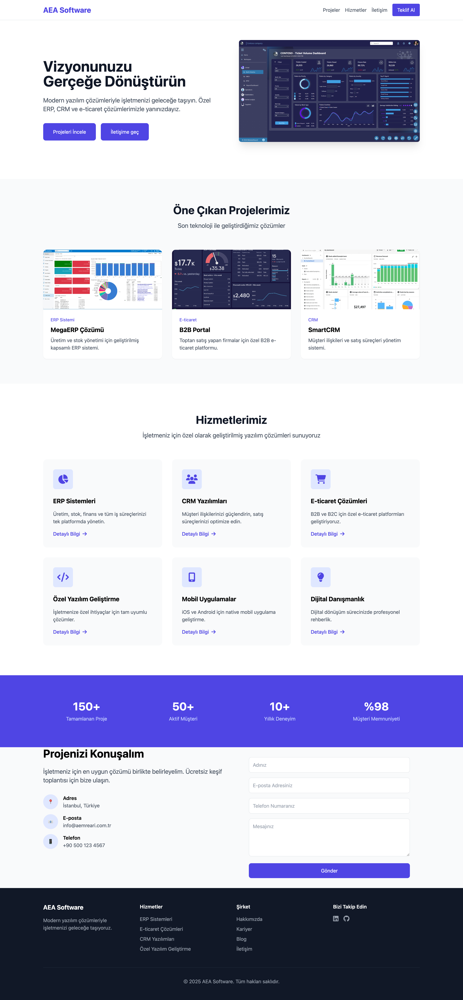

# AEA Software - Modern Yazılım Çözümleri | Modern Software Solutions

<div align="center">
  
</div>

## 🇹🇷 Türkçe

### 📋 Proje Hakkında
Modern tasarım ve teknolojilerle geliştirilmiş kurumsal web sitesi. İşletmelere özel yazılım çözümleri sunan bir şirketin landing page'i.

### ⚡ Özellikler
- Modern ve responsive tasarım
- Smooth scroll navigasyon
- Interaktif UI elementleri
- Cross-browser uyumluluğu
- İletişim formu entegrasyonu
- SEO dostu yapı

### 🔧 Kullanılan Teknolojiler
- HTML5
- CSS3
- Tailwind CSS
- Font Awesome
- Google Fonts

### 💻 Kurulum ve Kullanım
1. Repoyu klonlayın
```bash
git clone https://github.com/ahmetemreari/aea-software.git
```
2. Proje dizinine gidin
```bash
cd aea-software
```
3. Gerekli bağımlılıkları yükleyin
```bash
npm install
```
4. Projeyi başlatın
```bash
npm start
```

### 📸 Ekran Görüntüleri


### 🤝 İletişim
- GitHub: [github.com/ahmetemreari](https://github.com/ahmetemreari)
- LinkedIn: [linkedin.com/in/aemreari](https://www.linkedin.com/in/aemreari/)

---

## 🇺🇸 English

### 📋 About Project
Corporate website developed with modern design and technologies. A landing page for a company offering custom software solutions to businesses.

### ⚡ Features
- Modern and responsive design
- Smooth scroll navigation
- Interactive UI elements
- Cross-browser compatibility
- Contact form integration
- SEO friendly structure

### 🔧 Technologies Used
- HTML5
- CSS3
- Tailwind CSS
- Font Awesome
- Google Fonts

### 💻 Installation & Usage
1. Clone the repository
```bash
git clone https://github.com/ahmetemreari/aea-software.git
```
2. Go to project directory
```bash
cd aea-software
```
3. Install dependencies
```bash
npm install
```
4. Start the project
```bash
npm start
```

### 📸 Screenshots


### 🤝 Contact
- GitHub: [github.com/ahmetemreari](https://github.com/ahmetemreari)
- LinkedIn: [linkedin.com/in/aemreari](https://www.linkedin.com/in/aemreari/)

---

## 📝 License
Bu proje [MIT](LICENSE) lisansı ile lisanslanmıştır. | This project is licensed under the [MIT](LICENSE) License.
